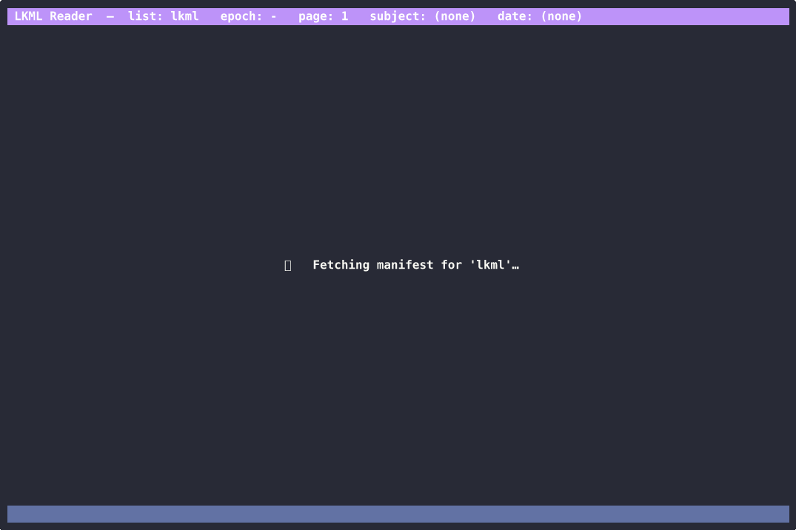

# lkml-reader

A Rust-based interactive reader for Linux Kernel Mailing Lists hosted on
[lore.kernel.org](https://lore.kernel.org), inspired by
[hackermail](https://github.com/sjp38/hackermail).

It mirrors lore's public-inbox git archives locally and provides a terminal UI
to browse and read mails. The main goal is to have a simple, fast, and
keyboard-friendly way to keep up with the latest discussions in the Linux kernel
community.

## Demo



## Features

- Pick any mailing list on lore.kernel.org (`linux-pm`, `linux-mm`,
  `linux-kernel`, `damon`, …) via `--list`.
- Filter by subsystem interactively with `/` (case-insensitive substring match
  against the subject, e.g. `sched` matches `[PATCH sched/core]`, `[sched]`,
  `[scheduler]`).
- Filter by date range with `d` (`today`, `yesterday`, or
  `YYYY/MM/DD HH:MM to YYYY/MM/DD HH:MM`).
- Read the raw mail in a scrollable detail pane with diff-aware coloring
  (green `+`, red `-`, cyan `@@`).

## Build & run

```sh
git submodule update --init   # fetch vendor/lkml-core on first checkout
cargo build --release

# Launch the TUI — clones the latest epoch on first run, runs
# `git remote update` on every subsequent start.
./target/release/lkml-reader --list lkml
```

Or via the Makefile:

```sh
make run-reader                      # defaults to LIST=lkml
make run-reader LIST=linux-pm
```

CLI:

```
lkml-reader [--list <LIST>]
```

Defaults: `--list lkml`.

## Keys

| View   | Key                    | Action                          |
|--------|------------------------|---------------------------------|
| List   | `↑` / `↓`              | Move selection within page      |
| List   | `←` / `→`              | Previous / next page            |
| List   | `Enter`                | Open mail                       |
| List   | `r`                    | Reply to mail (see [Replying](#replying)) |
| List   | `/`                    | Set subject filter (lazy per-epoch, auto-clones older epochs as you page) |
| List   | `d`                    | Set date filter                 |
| List   | `u`                    | Update current mirror (`git remote update`) |
| List   | `?`                    | Help                            |
| List   | `q`                    | Quit                            |
| Detail | `↑`/`↓`, `PgUp`/`PgDn` | Scroll                          |
| Detail | `g` / `G`              | Top / bottom                    |
| Detail | `r`                    | Reply to mail (see [Replying](#replying)) |
| Detail | `Esc` / `q`            | Back to list                    |

## Replying

`r` builds a reply draft: open it in `$EDITOR`, and sends it with `git send-email`.

Your identity and mail server come from git. Configure them once:

```sh
git config --global user.name "Your Name"
git config --global user.email you@example.org
git config --global sendemail.smtpServer smtp.example.org
git config --global sendemail.smtpUser you@example.org
git config --global sendemail.smtpEncryption tls
git config --global sendemail.smtpServerPort 587
```

`git help send-email` covers the rest, including using a local `msmtp`/`sendmail`
instead of SMTP, and keeping the password out of the config file.

